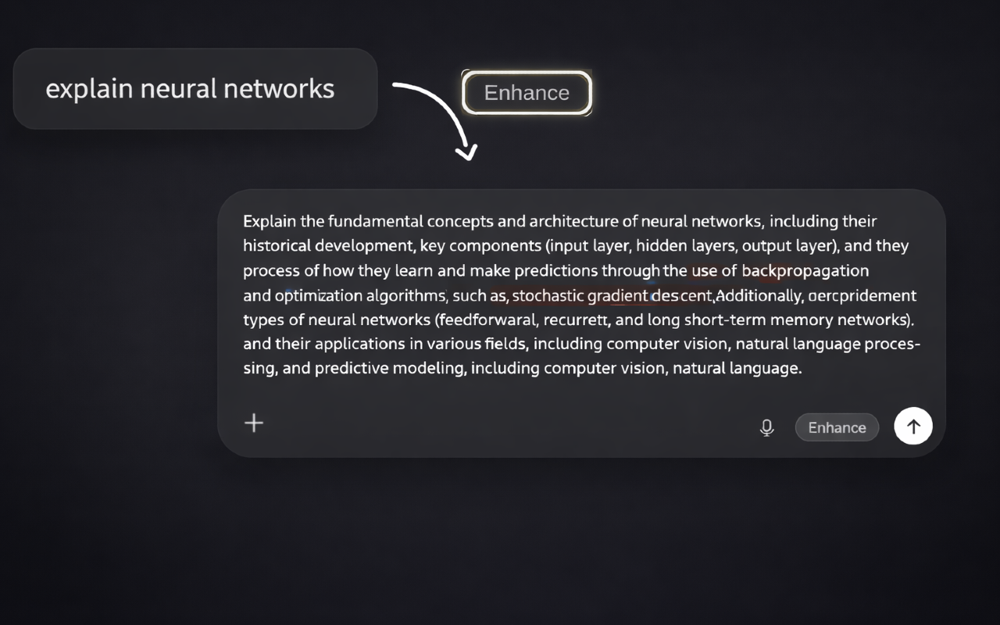

# PromptLord — AI Prompt Enhancer for ChatGPT, Claude & Gemini

> **Turn vague, one-line prompts into detailed, well-structured prompts in one click — and get noticeably better answers from any AI chatbot.**

PromptLord is a free, open-source **Chrome/Edge browser extension** that adds a one-click **"Enhance" button** (and a `Ctrl/Cmd + Shift + E` shortcut) to **ChatGPT, Claude, and Google Gemini**. It rewrites your prompt with clear persona, task, context, and format — powered by **Groq's `llama-3.1-8b-instant`** for sub-second results.

[](https://github.com/tejaspatil1936/PromptLord)
[](LICENSE)
[](manifest.json)
[](https://groq.com)

⚡ **Sub-second enhancement** • 🆓 **100% free** • 🔐 **Keys stay server-side** • 🌐 **Works on ChatGPT, Claude & Gemini**



---

## Table of Contents

- [Why PromptLord?](#why-promptlord)
- [Features](#features)
- [Supported AI Platforms](#supported-ai-platforms)
- [How It Works](#how-it-works)
- [Quick Start](#quick-start)
- [Local Development](#local-development)
- [Project Structure](#project-structure)
- [Architecture](#architecture)
- [Performance](#performance)
- [Security & Privacy](#security--privacy)
- [Documentation](#documentation)
- [Contributing](#contributing)
- [License](#license)

---

## Why PromptLord?

Most people write short, underspecified prompts and get generic answers back. **Prompt engineering** fixes that, but doing it by hand every time is tedious. PromptLord automates it: type your rough idea, press **Enhance**, and PromptLord rewrites it into a clear, structured prompt — without ever submitting it for you, so you stay in control.

**Before:** `write a cold email`

**After PromptLord:** *"Write a professional cold email for B2B SaaS outreach. Include a compelling subject line, a personalized intro referencing the recipient's company, a clear value proposition, social proof with specific metrics, a soft call-to-action, and a professional signature. Keep it to 150–200 words in a conversational yet professional tone."*

## Features

- ⚡ **Lightning fast** — powered by Groq's `llama-3.1-8b-instant` model (500+ tokens/sec), typically 0.5–1s per enhancement
- 🆓 **Completely free** — runs on Groq's free API tier; no credit card, no subscription
- ⌨️ **One click or one shortcut** — click the **Enhance** pill or press `Ctrl/Cmd + Shift + E`
- 🔐 **Secure by design** — API keys live only on your backend; the browser never sees them
- 🔄 **Multi-key rotation** — round-robin across multiple Groq keys with automatic failover for high availability
- 🛡️ **Hardened backend** — CORS allowlist, per-IP rate limiting, input validation, and payload-size limits
- 🎯 **Never auto-sends** — PromptLord only rewrites the text in the composer; you press send when you're ready
- 🎨 **Native-feeling UI** — the Enhance button appears inline next to the send button and respects light/dark mode

## Supported AI Platforms

| Platform | URL | Status |
|----------|-----|--------|
| **ChatGPT** (OpenAI) | [chatgpt.com](https://chatgpt.com) | ✅ Supported |
| **Claude** (Anthropic) | [claude.ai](https://claude.ai) | ✅ Supported |
| **Gemini** (Google) | [gemini.google.com](https://gemini.google.com) | ✅ Supported |

> The extension is scoped to these hosts in `manifest.json` (`content_scripts.matches`). To support more sites, add their URLs there.

## How It Works

```
Browser Extension                Background Worker            Backend (Node/Express)        Groq Cloud
─────────────────                ─────────────────            ──────────────────────        ──────────
Enhance button / shortcut  ──▶   chrome.runtime message  ──▶  POST /enhance            ──▶  llama-3.1-8b-instant
(reads composer text)            (enhance_prompt)             validate → rotate key         (rewrites prompt)
       ▲                                                      → call Groq                          │
       └──────────────  enhanced prompt written back to the composer  ◀───────────────────────────┘
```

1. The content script detects the prompt box on ChatGPT/Claude/Gemini and shows the **Enhance** button when there's text.
2. Clicking it (or pressing `Ctrl/Cmd + Shift + E`) sends the text to the **background service worker** via an `enhance_prompt` message.
3. The worker forwards it to your **backend** (`/enhance`), which validates the input, picks a Groq API key (round-robin with failover), and calls Groq.
4. The enhanced prompt is written back into the composer. **It is never submitted automatically.**

## Quick Start

### Prerequisites

- A Chromium browser (Chrome or Edge) with **Manifest V3** support
- A free **Groq** account for API keys
- A place to host the backend (e.g. **Render** free tier)

### 1. Get your free Groq API keys

1. Go to [console.groq.com](https://console.groq.com) and sign up (free, no credit card).
2. Create **3–5 API keys** for better throughput and automatic failover.

📖 Full walkthrough: **[GROQ_SETUP.md](GROQ_SETUP.md)**

### 2. Deploy the backend (free on Render)

1. Fork this repository.
2. Create a new **Web Service** on [Render](https://render.com) and connect your fork. Set the root directory to `server/` (or build/start with `cd server && npm install && npm start`).
3. Add an environment variable:
   ```
   GROQ_API_KEYS=gsk_key1,gsk_key2,gsk_key3
   ```
4. (Optional) Set `RENDER_URL=https://your-app.onrender.com` to enable the keep-alive ping that prevents free-tier cold starts.
5. Deploy and copy your backend URL.

### 3. Point the extension at your backend

The backend URL appears in **two** places — update both:

- `manifest.json` → `host_permissions`
  ```json
  "host_permissions": ["https://your-app.onrender.com/*"]
  ```
- `src/background.js` → the `fetch(...)` URLs in `handleEnhanceRequest` and `keepAlive`

### 4. Load the extension

1. Clone your fork:
   ```bash
   git clone https://github.com/tejaspatil1936/PromptLord.git
   cd PromptLord
   ```
2. Open `chrome://extensions/`, enable **Developer mode** (top right).
3. Click **Load unpacked** and select the `PromptLord` directory.
4. Open ChatGPT, Claude, or Gemini, type a prompt, and click **Enhance**. 🎉

## Local Development

```bash
# Backend
cd server
npm install
cp .env.example .env          # then add your GROQ_API_KEYS
npm start                     # runs on http://localhost:3000
```

The backend ships with test scripts you can run against a running server:

```bash
node test_prompts.js          # exercises the /enhance endpoint
node test_validation.js       # exercises input-validation edge cases
```

CORS automatically allows `localhost`/`127.0.0.1` in development. For the extension side, just reload it from `chrome://extensions/` after edits.

## Project Structure

```
PromptLord/
├── src/
│   ├── content/
│   │   ├── index.js          # ★ SHIPPING content script (monolithic PromptEnhancer)
│   │   ├── bootstrap.js       # Entry for the alternative layered design (not wired in manifest)
│   │   ├── main.js, detection.js, overlay.js, insertion.js, pill.js,
│   │   ├── textio.js, lifecycle.js, governance.js, adapters.js,
│   │   ├── transport.js, util.js   # Layered "capability-based" design (see ARCHITECTURE)
│   │   └── ARCHITECTURE.md    # Docs for the layered content-script design
│   ├── background.js          # Service worker: forwards prompts to the backend, keep-alive ping
│   ├── options/               # Optional settings/about page (not registered in manifest)
│   ├── pages/
│   │   └── welcome.html       # Post-install welcome page
│   └── styles/
│       └── main.css           # Enhance button styles
├── server/
│   ├── index.js              # Express API: /enhance, /health, Groq multi-key rotation
│   ├── test_prompts.js        # Endpoint smoke tests
│   ├── test_validation.js     # Input-validation tests
│   ├── package.json
│   └── .env.example
├── icons/                     # 16/48/128 px extension icons
├── docs/
│   └── privacy.html          # Hosted privacy policy
├── manifest.json             # Extension config (Manifest V3, v1.0.3)
├── ARCHITECTURE.md           # Backend multi-key rotation architecture
├── SECURITY.md               # Backend security model
├── GROQ_SETUP.md             # Groq API key setup guide
├── PRIVACY.md                # Privacy policy (source for docs/privacy.html)
└── LICENSE                   # MIT
```

## Architecture

**Frontend — Chrome Extension (Manifest V3).** The shipping content script (`src/content/index.js`) is a self-contained `PromptEnhancer` class that detects the composer on each supported site, injects the Enhance button, reads/writes prompt text, and talks to the background worker.

> **Two content-script designs live in this repo.** `src/content/index.js` is the **monolith that the manifest actually loads today**. The repo also contains a more advanced, **capability-based "six-layer" design** (`bootstrap.js` + `detection.js`/`overlay.js`/`lifecycle.js`/… ) documented in **[`src/content/ARCHITECTURE.md`](src/content/ARCHITECTURE.md)**. That layered design is **not currently wired into `manifest.json`** (the manifest loads `index.js` and has no `web_accessible_resources`), so treat it as an in-progress alternative rather than the running code. See that file for the rationale and module map.

**Background — Service worker.** `src/background.js` receives `enhance_prompt` messages, forwards them to the backend over HTTPS, maps `402/403` responses to a friendly "limit reached" state, and pings the backend periodically to avoid free-tier cold starts.

**Backend — Node.js + Express.** `server/index.js` validates input, rotates across multiple Groq API keys (round-robin with a 60s cooldown on failed keys and up to 3 retries), and exposes a `/health` endpoint. **API keys never leave the server.**

**AI engine — Groq Cloud.** Model `llama-3.1-8b-instant` for 500+ tokens/sec throughput and sub-second latency.

📖 Backend rotation deep-dive: **[ARCHITECTURE.md](ARCHITECTURE.md)** · Content-layer design: **[src/content/ARCHITECTURE.md](src/content/ARCHITECTURE.md)**

## Performance

| Metric | Value |
|--------|-------|
| Response time | ~0.5–1 second |
| Throughput | 500+ tokens/sec (Groq) |
| Groq capacity | ~30 requests/min **per key** (×N keys with rotation) |
| Backend per-IP limit | 100 requests/min, min 2s between requests |
| Max prompt length | 5,000 characters |
| Cost | **$0 / month** |

## Security & Privacy

PromptLord is built so your AI provider keys are never exposed and your prompts aren't retained:

- ✅ **Server-side API keys** — keys live in backend env vars, never in the extension or network requests
- ✅ **CORS allowlist** — only browser-extension origins (and `localhost` in dev) may call the backend
- ✅ **Per-IP rate limiting** — 100 requests/min per IP plus a 2s minimum interval (anti-spam)
- ✅ **Input validation** — type checks, 2–5,000 character bounds, and a 10KB payload cap
- ✅ **No prompt retention** — prompts are processed transiently and not stored or logged
- ✅ **HTTPS everywhere** for backend and Groq communication

🔒 Full security model: **[SECURITY.md](SECURITY.md)** · 🕵️ Privacy policy: **[PRIVACY.md](PRIVACY.md)**

## Documentation

- **[ARCHITECTURE.md](ARCHITECTURE.md)** — backend multi-key rotation, failover, and scaling
- **[src/content/ARCHITECTURE.md](src/content/ARCHITECTURE.md)** — the layered content-script design (alternative, not yet wired)
- **[SECURITY.md](SECURITY.md)** — how API keys stay hidden and how the backend is hardened
- **[GROQ_SETUP.md](GROQ_SETUP.md)** — step-by-step Groq API key setup
- **[PRIVACY.md](PRIVACY.md)** — data handling and privacy policy

## Contributing

Contributions are welcome — bug reports, feature ideas, and pull requests all help. If you're adding support for a new AI site, update `content_scripts.matches` in `manifest.json` and the detection logic in the content script.

## License

Licensed under the **MIT License** — see [LICENSE](LICENSE).

## Author

**Tejas Patil** — [@tejaspatil1936](https://github.com/tejaspatil1936)

If PromptLord saves you time, please ⭐ the repo and consider [buying me a coffee](https://buymeacoffee.com/tejaspatil1936).

---

<div align="center">

**Made with ❤️ by Tejas Patil**

</div>

<!--
Keywords: AI prompt enhancer, prompt engineering tool, ChatGPT prompt optimizer, Claude prompt enhancer,
Gemini prompt improver, Chrome extension for ChatGPT, free prompt generator, one-click prompt enhancement,
Groq llama-3.1-8b-instant, browser extension prompt rewriter, better AI responses, Manifest V3 extension.
-->
